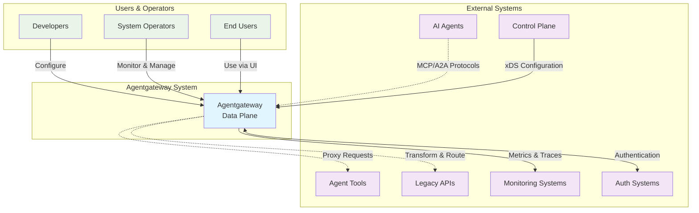

# System Context (C4 Level 1)

## Overview

Agentgateway is an open-source data plane optimized for agentic AI connectivity, providing drop-in security, observability, and governance for agent-to-agent and agent-to-tool communication.

## System Context Diagram

## System Purpose

**Primary Purpose**: Act as a secure, high-performance data plane that enables seamless communication between AI agents and their tools, while providing enterprise-grade security, observability, and governance.

### Key Capabilities

1. **Protocol Translation**: Support for MCP (Model Context Protocol) and A2A (Agent2Agent) protocols
2. **Legacy Integration**: Transform legacy REST/OpenAPI services into agent-compatible resources
3. **Security Gateway**: RBAC, authentication, authorization, and secure communication
4. **Multi-tenancy**: Isolated environments for different organizations or teams
5. **Dynamic Configuration**: Hot-reload configuration without downtime
6. **Observability**: Comprehensive metrics, tracing, and logging

## Stakeholders

### Primary Users

#### AI Agent Developers
- **Role**: Build and deploy AI agents that need to communicate with tools and other agents
- **Needs**: Easy integration, reliable communication, debugging capabilities
- **Interactions**: Configure agent connections, deploy agents, monitor performance

#### Platform Operators  
- **Role**: Manage and operate Agentgateway infrastructure
- **Needs**: Scalability, reliability, monitoring, security management
- **Interactions**: Deploy and configure gateway, monitor health, manage policies

#### Tool Providers
- **Role**: Provide tools and services that agents can access
- **Needs**: Secure access control, usage monitoring, integration support
- **Interactions**: Expose APIs through gateway, configure access policies

### Secondary Users

#### End Users
- **Role**: Interact with AI agents through applications
- **Needs**: Reliable service, data privacy, good performance
- **Interactions**: Use applications that rely on Agentgateway (indirect)

#### Security Teams
- **Role**: Ensure secure operation and compliance
- **Needs**: Security monitoring, access control, audit trails
- **Interactions**: Configure security policies, monitor for threats

#### DevOps Engineers
- **Role**: Deploy and maintain the infrastructure
- **Needs**: Easy deployment, monitoring, troubleshooting
- **Interactions**: Deploy infrastructure, configure CI/CD, monitor systems

## External Systems

### AI Agents
- **Description**: AI systems that need to access tools and communicate with other agents
- **Protocols**: MCP, A2A, custom protocols
- **Data Exchange**: Structured requests/responses, real-time communication
- **Dependencies**: Reliable connectivity, authentication, authorization

### Agent Tools
- **Description**: Services and APIs that provide capabilities to AI agents
- **Examples**: File systems, databases, web services, specialized tools
- **Protocols**: MCP server protocol, HTTP REST, gRPC
- **Integration**: Direct connection or through protocol adapters

### Legacy APIs
- **Description**: Existing REST APIs and services that need agent integration
- **Protocols**: HTTP REST, OpenAPI specifications, gRPC (future)
- **Transformation**: Convert to MCP-compatible resources
- **Authentication**: Various schemes (OAuth, API keys, basic auth)

### Control Plane
- **Description**: Optional centralized configuration management system
- **Protocol**: xDS (Envoy Discovery Service)
- **Purpose**: Dynamic configuration updates, policy distribution
- **Benefits**: Centralized management, zero-downtime updates

### Monitoring Systems
- **Description**: Observability and monitoring infrastructure
- **Protocols**: OpenTelemetry, Prometheus metrics, structured logging
- **Data Types**: Metrics, traces, logs, alerts
- **Examples**: Prometheus, Grafana, Jaeger, ELK Stack

### Authentication Systems
- **Description**: Identity and access management systems
- **Protocols**: OAuth 2.0, JWT tokens, OIDC
- **Purpose**: User authentication, service-to-service auth
- **Integration**: RBAC policy enforcement, token validation

## System Boundaries

### Included in System
- **Core Proxy Engine**: Request routing and protocol translation
- **Security Layer**: Authentication, authorization, encryption
- **Configuration Management**: Static, local, and XDS-based configuration
- **Observability**: Metrics collection, tracing, logging
- **Web UI**: Management and monitoring interface
- **Protocol Adapters**: MCP, A2A, HTTP translation layers

### External Dependencies
- **Agent Implementations**: AI agents using the gateway
- **Tool Services**: Backend services providing capabilities
- **Configuration Sources**: File systems, control planes
- **Identity Providers**: Authentication and authorization systems
- **Monitoring Infrastructure**: Metrics and log collection systems

### Non-Goals
- **Agent Development**: Not an agent framework or runtime
- **Tool Implementation**: Not a tool or service provider
- **Model Hosting**: Not an LLM hosting platform
- **Data Storage**: Not a primary data store (configuration only)

## Key Quality Requirements

### Performance
- **Latency**: Sub-millisecond request routing overhead
- **Throughput**: Handle thousands of concurrent connections
- **Scalability**: Linear scaling with resource addition

### Reliability
- **Availability**: 99.9% uptime for production deployments
- **Fault Tolerance**: Graceful degradation during failures
- **Recovery**: Fast restart and state recovery

### Security
- **Encryption**: TLS 1.3 for all external communication
- **Authentication**: Multi-factor authentication support
- **Authorization**: Fine-grained RBAC policies
- **Audit**: Comprehensive security audit logging

### Operability
- **Monitoring**: Rich metrics and distributed tracing
- **Configuration**: Hot-reload without service interruption
- **Deployment**: Container-native, multi-platform support
- **Maintenance**: Automated updates and health checks

## Business Context

### Value Proposition
- **Reduced Integration Complexity**: Single gateway for all agent communications
- **Enhanced Security**: Enterprise-grade security without custom implementation
- **Improved Observability**: Comprehensive monitoring and debugging capabilities
- **Future-Proof Architecture**: Support for emerging agent protocols

### Business Drivers
- **AI Adoption**: Growing need for agent-to-agent communication
- **Security Requirements**: Enterprise security and compliance needs
- **Operational Efficiency**: Simplified management of agent ecosystems
- **Cost Optimization**: Reduced development and operational overhead

### Success Metrics
- **Adoption**: Number of agents and tools using the gateway
- **Performance**: Request latency and throughput metrics
- **Reliability**: Uptime and error rate measurements
- **Security**: Number of security incidents prevented
- **Developer Experience**: Time to integrate new agents/tools