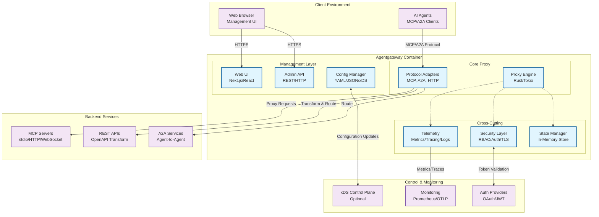
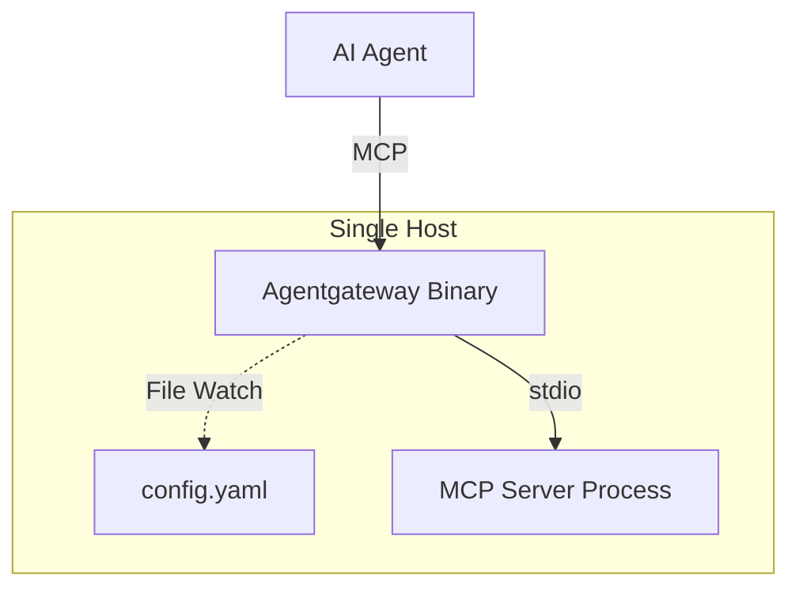
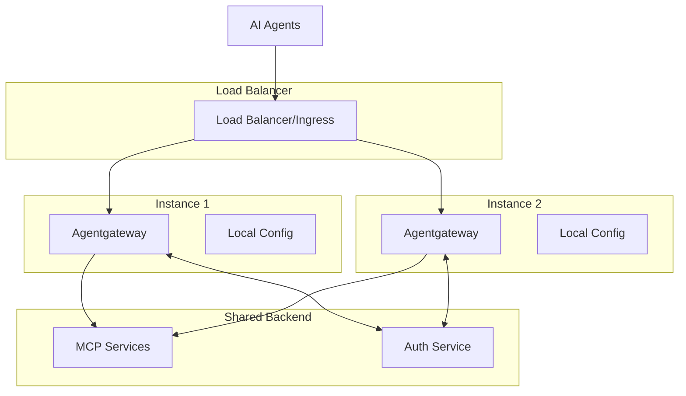
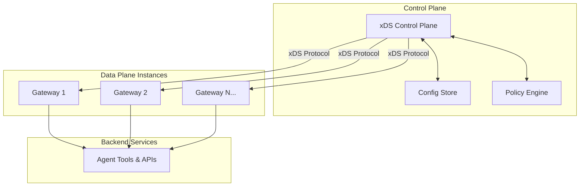

# Container Architecture (C4 Level 2)

## Overview

Agentgateway is designed as a high-performance, single-binary data plane that can be deployed in various configurations from standalone single-node setups to large-scale distributed deployments.

## Container Diagram

## Container Breakdown

### Agentgateway Container (Single Binary)

The Agentgateway container is a single Rust binary that includes all components:

#### Core Proxy Engine
- **Technology**: Rust with Tokio async runtime
- **Responsibility**: High-performance request routing and protocol handling
- **Key Features**:
  - Sub-millisecond routing latency
  - Thousands of concurrent connections
  - Memory-efficient connection pooling
  - Zero-copy request forwarding where possible

#### Protocol Adapters
- **Technology**: Rust with protocol-specific implementations
- **Supported Protocols**:
  - **MCP (Model Context Protocol)**: stdio, HTTP, WebSocket transports
  - **A2A (Agent2Agent)**: RESTful agent communication
  - **HTTP/REST**: Legacy API transformation via OpenAPI specs
- **Responsibilities**:
  - Protocol translation and normalization
  - Request/response transformation
  - Error handling and retry logic

#### Web UI
- **Technology**: Next.js 15+ with React 19.1+ and TypeScript 5+
- **Build Process**: Compiled to static assets, served by Rust binary
- **Features**:
  - Real-time connection monitoring
  - Configuration management interface
  - Request tracing and debugging
  - Multi-tenant administration
- **Security**: Same-origin policy, CSRF protection

#### Admin API
- **Technology**: Rust with Axum web framework
- **Endpoints**:
  - `/admin/*` - Administrative functions
  - `/stats` - Runtime statistics
  - `/ready` - Health check endpoint
  - `/metrics` - Prometheus metrics
- **Security**: Bearer token authentication, RBAC

#### Configuration Manager
- **Supported Sources**:
  - **Static**: Environment variables, command-line flags
  - **Local**: YAML/JSON files with hot-reload
  - **xDS**: Remote control plane configuration
- **Features**:
  - Configuration validation with JSON Schema
  - Hot-reload without service interruption
  - Configuration merging and precedence rules

#### Security Layer
- **Authentication**: JWT token validation, mTLS client certificates
- **Authorization**: Fine-grained RBAC policies
- **Encryption**: TLS 1.3 for all external communication
- **Features**:
  - Multi-tenant isolation
  - Policy evaluation at request time
  - Audit logging for security events

#### Telemetry
- **Metrics**: Prometheus format, custom agentgateway metrics
- **Tracing**: OpenTelemetry distributed tracing
- **Logging**: Structured JSON logging with configurable levels
- **Features**:
  - Request/response correlation
  - Performance monitoring
  - Error tracking and alerting

#### State Manager
- **Technology**: In-memory data structures with Arc<RwLock>
- **Scope**: Runtime configuration, connection state, metrics
- **Features**:
  - Thread-safe concurrent access
  - Efficient memory usage
  - Fast lookup for routing decisions

## Deployment Models

### Standalone Deployment

**Use Cases**: Development, small-scale production, edge deployment
**Benefits**: Simple setup, minimal resource requirements, easy debugging

### Multi-Instance Deployment

**Use Cases**: High availability, horizontal scaling, geographic distribution
**Benefits**: Load distribution, fault tolerance, regional deployment

### Control Plane Deployment

**Use Cases**: Large-scale enterprise deployment, centralized management
**Benefits**: Dynamic configuration, policy consistency, operational efficiency

## Technology Choices

### Core Technologies

#### Rust Language
- **Rationale**: Zero-cost abstractions, memory safety, high performance
- **Benefits**: Predictable performance, low resource usage, concurrent safety
- **Trade-offs**: Learning curve, longer compilation times

#### Tokio Async Runtime
- **Rationale**: High-performance async I/O, mature ecosystem
- **Benefits**: Efficient handling of thousands of connections
- **Integration**: Native integration with HTTP/2, WebSockets, TCP

#### Next.js Frontend
- **Rationale**: Modern React framework with SSG/SSR capabilities
- **Benefits**: Developer experience, build optimization, type safety
- **Integration**: Compiled to static assets served by Rust binary

### Communication Protocols

#### HTTP/2
- **Usage**: Primary transport for web UI, admin API, HTTP backends
- **Benefits**: Multiplexing, header compression, server push
- **Implementation**: hyper-rs HTTP/2 implementation

#### WebSocket
- **Usage**: Real-time communication with agents, MCP transport
- **Benefits**: Low latency, bidirectional communication
- **Implementation**: tokio-tungstenite WebSocket library

#### gRPC (xDS)
- **Usage**: Control plane communication
- **Benefits**: Type-safe, efficient serialization, streaming
- **Implementation**: tonic gRPC library

## Resource Requirements

### Minimum Requirements
- **CPU**: 1 vCPU (x86_64 or ARM64)
- **Memory**: 256 MB RAM
- **Storage**: 100 MB (binary + config)
- **Network**: 10 Mbps bandwidth

### Recommended Production
- **CPU**: 2-4 vCPUs
- **Memory**: 1-2 GB RAM
- **Storage**: 1 GB (logs, metrics, temporary files)
- **Network**: 100 Mbps+ bandwidth

### High-Scale Enterprise
- **CPU**: 8+ vCPUs with dedicated cores
- **Memory**: 4-8 GB RAM
- **Storage**: 10+ GB SSD
- **Network**: 1+ Gbps bandwidth

## Scalability Patterns

### Horizontal Scaling
- **Approach**: Multiple agentgateway instances behind load balancer
- **State**: Stateless design enables linear scaling
- **Coordination**: Optional shared control plane for policy consistency

### Vertical Scaling
- **CPU Scaling**: Configurable worker thread pool size
- **Memory Scaling**: Efficient memory management with configurable limits
- **Connection Scaling**: Configurable connection pool sizes

### Geographic Distribution
- **Edge Deployment**: Regional agentgateway instances
- **Data Locality**: Route requests to geographically close backends
- **Latency Optimization**: Edge caching and connection pooling

## Reliability Features

### Fault Tolerance
- **Circuit Breakers**: Prevent cascade failures to backends
- **Retry Logic**: Configurable retry policies with exponential backoff
- **Health Checks**: Active and passive health monitoring
- **Graceful Degradation**: Continue operating with reduced functionality

### High Availability
- **Stateless Design**: No single points of failure
- **Fast Startup**: Sub-second startup time for quick failover
- **Rolling Updates**: Zero-downtime deployments
- **Configuration Validation**: Prevent invalid configuration deployment

### Monitoring Integration
- **Health Endpoints**: `/ready`, `/health`, `/stats` endpoints
- **Metrics Export**: Prometheus metrics for monitoring systems
- **Distributed Tracing**: OpenTelemetry integration for request tracing
- **Structured Logging**: JSON logs with correlation IDs