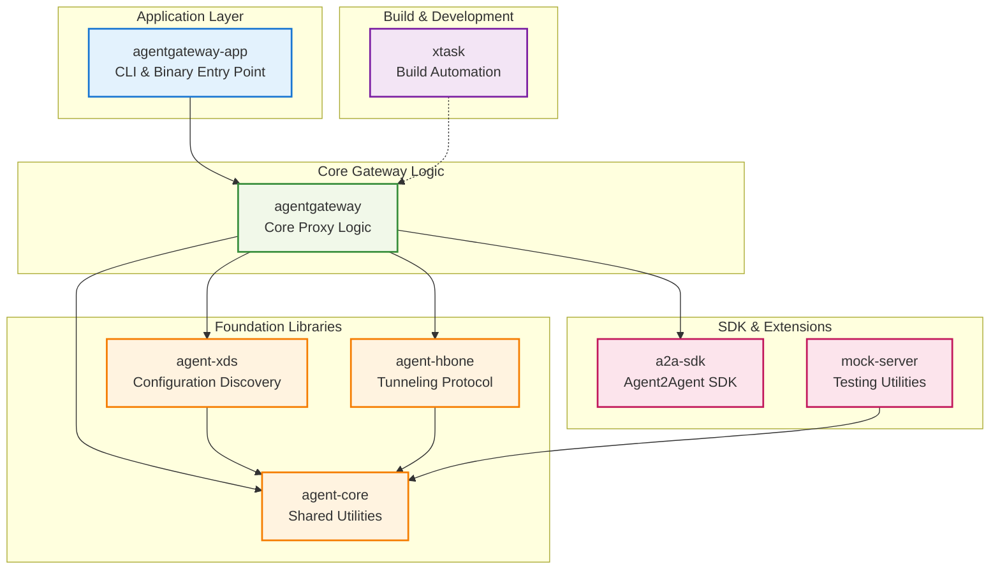
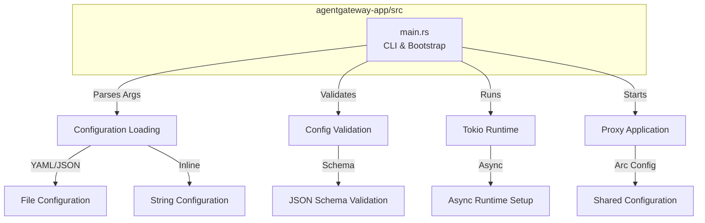
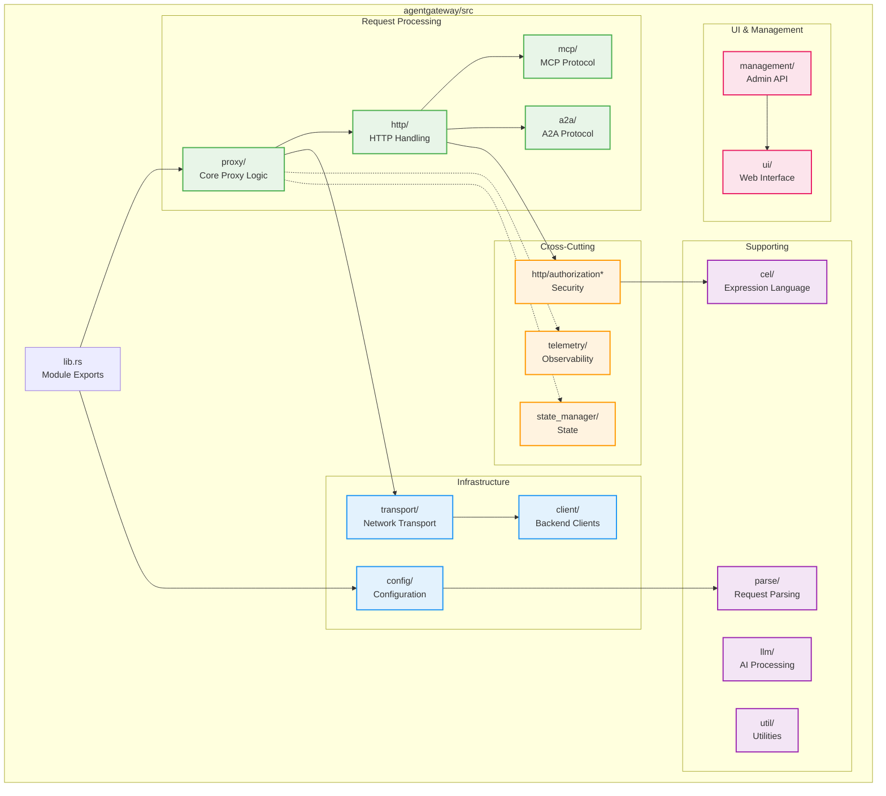
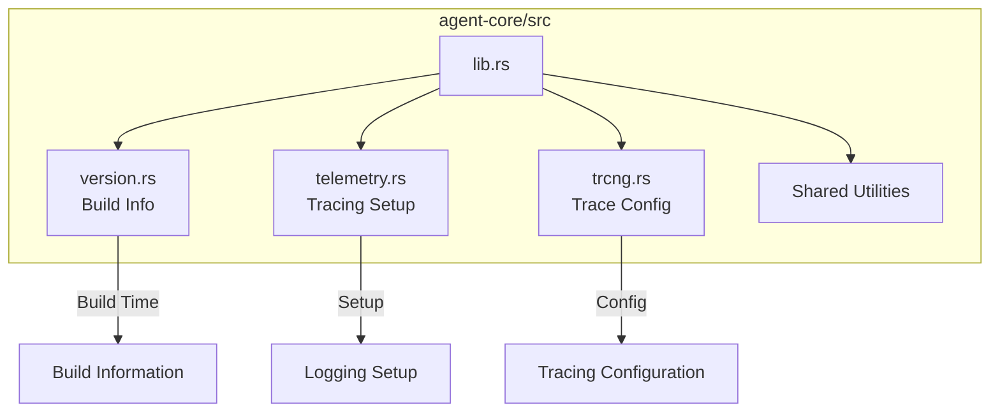
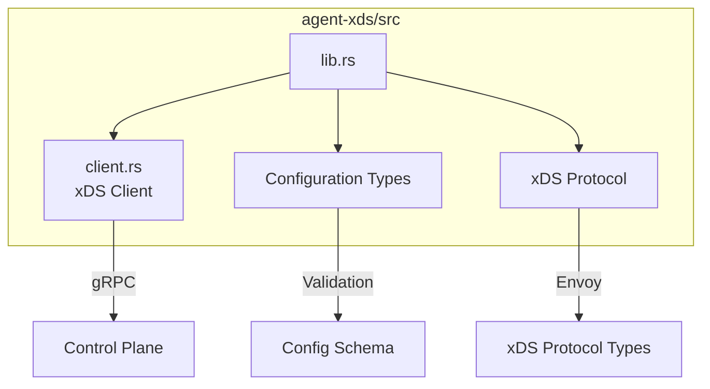
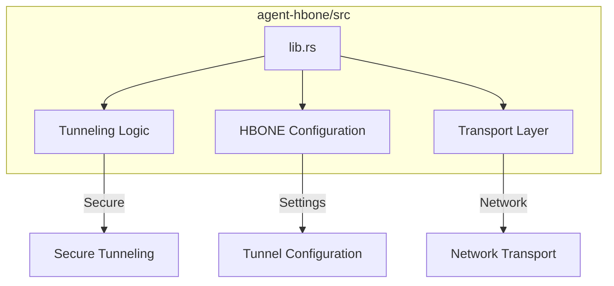
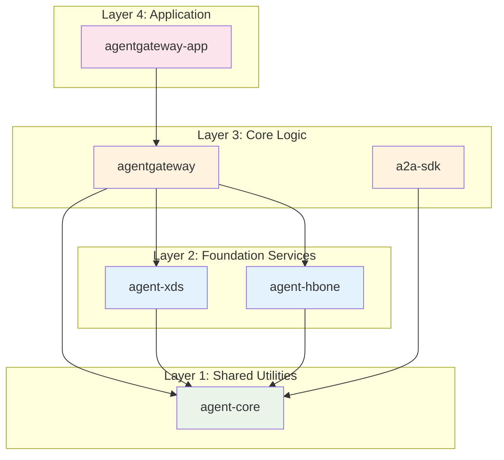
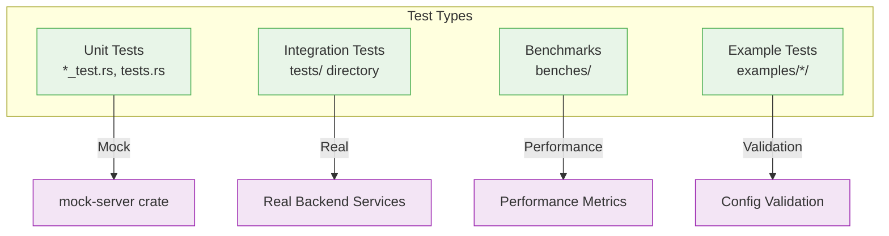

# Component Architecture (C4 Level 3)

## Overview

This document describes the internal component structure of Agentgateway, detailing the Rust crate organization, module dependencies, and key architectural patterns used throughout the system.

## Crate Architecture Diagram

## Core Crates

### agentgateway-app (Application Entry Point)

**Responsibilities**:
- Command-line argument parsing and validation
- Configuration loading from files or command-line
- Application bootstrap and lifecycle management
- Tokio runtime configuration and startup
- Graceful shutdown handling

**Key Components**:
- `main()` - Entry point with argument parsing
- `validate()` - Configuration validation logic
- `proxy()` - Main application runner
- `copy_binary()` - Utility for container deployment

### agentgateway (Core Gateway Logic)

#### Request Processing Components

##### proxy/ - Core Proxy Logic
- **gateway.rs**: Main request gateway and routing engine
- **httpproxy.rs**: HTTP-specific proxy implementation
- **tcpproxy.rs**: TCP-level proxy for non-HTTP protocols
- **request_builder.rs**: Request construction and transformation utilities

##### http/ - HTTP Protocol Handling
- **mod.rs**: HTTP module exports and routing setup
- **route_test.rs**: Route matching and selection logic
- **filters_test.rs**: Request/response filtering pipeline
- **transformation*.rs**: Request/response transformation logic
- **authorization*.rs**: HTTP-level authorization and security
- **retry/**: Retry logic and failure handling

##### mcp/ - Model Context Protocol
- **mod.rs**: MCP protocol implementation entry point
- **openapi/**: OpenAPI to MCP transformation logic
- **tests.rs**: MCP protocol test suite
- Transport adapters for stdio, HTTP, WebSocket

##### a2a/ - Agent2Agent Protocol
- **mod.rs**: A2A protocol implementation
- **tests.rs**: A2A protocol test suite
- RESTful agent-to-agent communication patterns

#### Infrastructure Components

##### config/ - Configuration Management
- **mod.rs**: Configuration loading and parsing
- **parse_config()**: YAML/JSON configuration parser
- Schema validation and merging logic
- Hot-reload file watching

##### transport/ - Network Transport Layer
- **mod.rs**: Transport abstraction layer
- Connection pooling and management
- Protocol-agnostic transport implementations
- TLS and security transport wrappers

##### client/ - Backend Client Management
- **mod.rs**: Backend client abstraction
- **dns_tests.rs**: DNS resolution and service discovery
- HTTP client pool management
- Connection health checking and circuit breaking

#### Cross-Cutting Components

##### Security (http/authorization*)
- **authorization_tests.rs**: Authorization policy testing
- RBAC policy evaluation engine
- JWT token validation and parsing
- Multi-tenant security isolation

##### telemetry/ - Observability
- **mod.rs**: Telemetry setup and configuration
- **log.rs**: Structured logging configuration
- **trc.rs**: Distributed tracing setup
- Metrics collection and export

##### state_manager/ - Runtime State
- **mod.rs**: In-memory state management
- Thread-safe state sharing (Arc<RwLock>)
- Configuration state and runtime metrics
- Connection tracking and lifecycle

### Foundation Libraries

#### agent-core (Shared Utilities)

**Responsibilities**:
- Build information and version management
- Shared telemetry and logging setup
- Common utilities across all crates
- Version information for runtime introspection

#### agent-xds (Configuration Discovery)

**Responsibilities**:
- xDS protocol client implementation
- Configuration discovery from control plane
- Dynamic configuration updates
- Protocol buffer message handling

#### agent-hbone (Tunneling Protocol)

**Responsibilities**:
- HBONE (HTTP-Based Overlay Network Encapsulation) protocol
- Secure tunneling between components
- Network overlay management
- Transport-level encryption and authentication

## Module Dependencies and Patterns

### Dependency Hierarchy

### Key Architectural Patterns

#### 1. Layered Architecture
- **Application Layer**: CLI and bootstrap logic
- **Core Logic**: Business logic and protocol handling
- **Foundation Services**: Infrastructure and utilities
- **Shared Utilities**: Common functionality across layers

#### 2. Modular Plugin Architecture
- **Protocol Adapters**: Pluggable protocol implementations
- **Transport Adapters**: Multiple transport layer options
- **Filter Pipeline**: Configurable request/response filters
- **Policy Engines**: Pluggable authorization and routing policies

#### 3. Async/Await Patterns
- **Tokio Runtime**: Single-threaded or multi-threaded async runtime
- **Async Traits**: Protocol-agnostic async interfaces
- **Stream Processing**: Async stream handling for WebSocket/gRPC
- **Concurrent Processing**: Parallel request handling with shared state

#### 4. Configuration-Driven Design
- **Declarative Configuration**: YAML/JSON configuration files
- **Schema Validation**: JSON Schema validation for all config
- **Hot Reload**: File-watching for configuration changes
- **Precedence Rules**: Clear configuration override hierarchy

#### 5. Error Handling Strategy
- **anyhow**: Error context and chaining throughout the system
- **thiserror**: Custom error types with structured information
- **Result Types**: Explicit error handling at all boundaries
- **Graceful Degradation**: Continue operation during partial failures

#### 6. Thread Safety and State Management
- **Arc<RwLock>**: Shared state with read-write locking
- **Atomic Operations**: Lock-free counters and flags
- **Message Passing**: Channel-based communication between components
- **Immutable Configuration**: Copy-on-write configuration updates

## Testing Architecture

### Test Organization

### Testing Patterns

#### Unit Testing
- **Embedded Tests**: Tests alongside source code in same file
- **Mock Backends**: Use mock-server crate for external dependencies
- **Property Testing**: Randomized testing for edge cases
- **Async Testing**: tokio::test for async function testing

#### Integration Testing
- **Docker Compose**: Real backend services for integration tests
- **Configuration Testing**: Validate example configurations
- **End-to-End**: Full request lifecycle testing
- **Performance Testing**: Benchmarks and load testing

## Build and Development Architecture

### Build System
- **Cargo Workspace**: Multi-crate project organization
- **Feature Flags**: Conditional compilation for different deployments
- **Cross Compilation**: Support for multiple platforms and architectures
- **Optimization Profiles**: Different optimization levels for dev/release

### Development Tools
- **xtask**: Custom build automation and development tasks
- **Schema Generation**: Automatic JSON schema generation from types
- **API Generation**: Protocol buffer and OpenAPI generation
- **Linting**: Comprehensive linting with clippy and rustfmt

### CI/CD Integration
- **GitHub Actions**: Automated testing and building
- **Multi-Platform**: Build for Linux, macOS, Windows, ARM64
- **Docker**: Containerized builds and deployments
- **Release Automation**: Automated release management and distribution