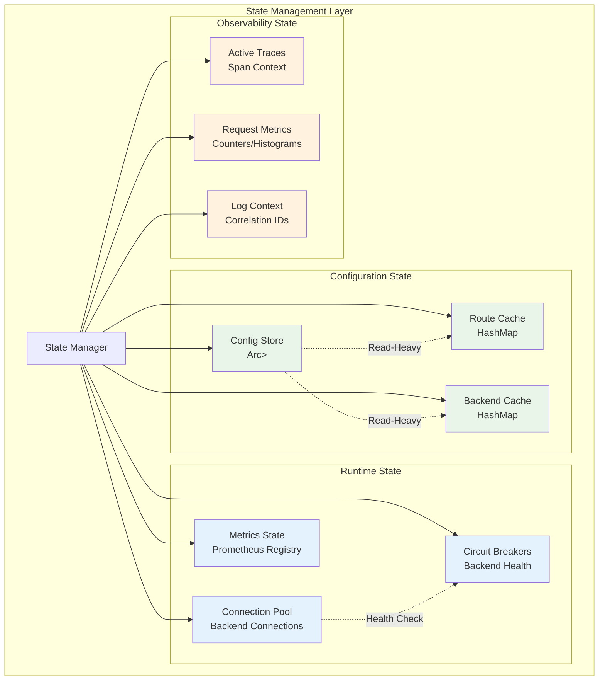
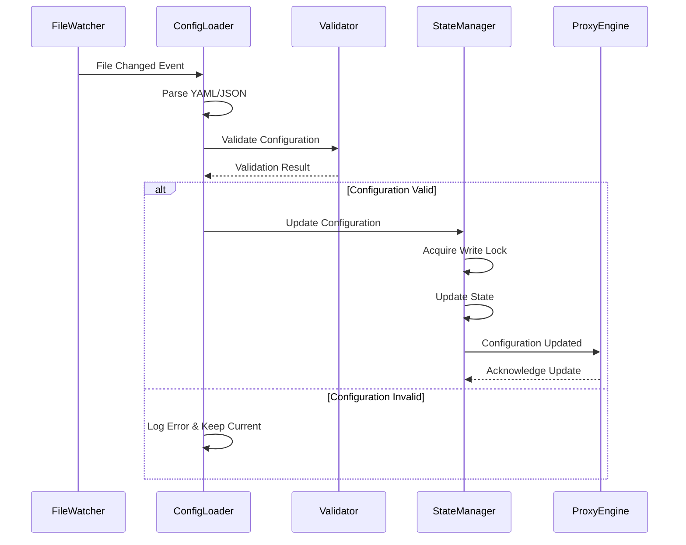
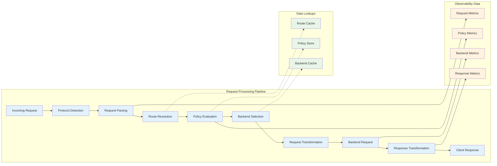
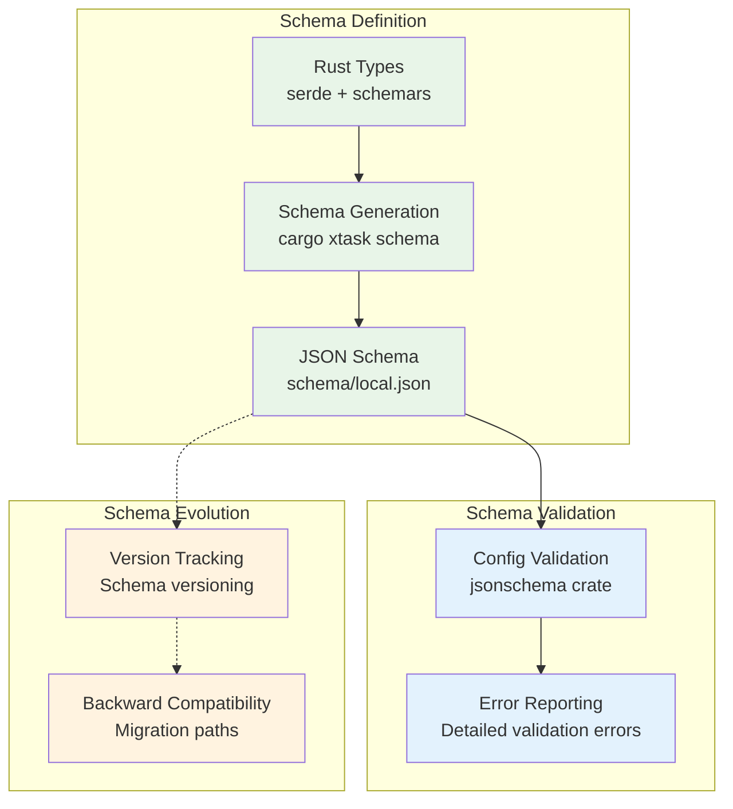

# Data Architecture

## Overview

Agentgateway is designed as a stateless data plane that primarily handles configuration data and runtime state. It does not store persistent application data but manages configuration, routing information, and observability data.

## Data Flow Architecture

```mermaid
graph TB
    subgraph "Configuration Data Flow"
        subgraph "Configuration Sources"
            StaticConfig[Static Config<br/>ENV/CLI Args]
            LocalConfig[Local Config<br/>YAML/JSON Files]
            XDSConfig[xDS Config<br/>Control Plane]
        end
        
        subgraph "Configuration Processing"
            ConfigParser[Config Parser<br/>YAML/JSON]
            SchemaValidator[Schema Validator<br/>JSON Schema]
            ConfigMerger[Config Merger<br/>Precedence Rules]
        end
        
        subgraph "Runtime State"
            InMemoryState[In-Memory State<br/>Arc<RwLock<Config>>]
            HotReload[Hot Reload<br/>File Watcher]
        end
    end
    
    subgraph "Request Data Flow"
        subgraph "Ingress"
            ClientRequests[Client Requests<br/>MCP/A2A/HTTP]
        end
        
        subgraph "Processing Pipeline"
            RequestParser[Request Parser<br/>Protocol Specific]
            RouteResolver[Route Resolver<br/>Config Lookup]
            PolicyEvaluator[Policy Evaluator<br/>RBAC/CEL]
            RequestTransformer[Request Transformer<br/>Protocol Translation]
        end
        
        subgraph "Egress"
            BackendRequests[Backend Requests<br/>HTTP/gRPC/stdio]
        end
    end
    
    subgraph "Observability Data Flow"
        subgraph "Collection"
            MetricsCollector[Metrics Collector<br/>Prometheus]
            TraceCollector[Trace Collector<br/>OpenTelemetry]
            LogCollector[Log Collector<br/>Structured JSON]
        end
        
        subgraph "Export"
            MetricsEndpoint[/metrics Endpoint]
            TraceExporter[OTLP Exporter]
            LogOutput[Stdout/File Output]
        end
    end
    
    StaticConfig --> ConfigParser
    LocalConfig --> ConfigParser
    XDSConfig --> ConfigParser
    
    ConfigParser --> SchemaValidator
    SchemaValidator --> ConfigMerger
    ConfigMerger --> InMemoryState
    LocalConfig -.-> HotReload
    HotReload -.-> ConfigParser
    
    ClientRequests --> RequestParser
    RequestParser --> RouteResolver
    RouteResolver --> PolicyEvaluator
    PolicyEvaluator --> RequestTransformer
    RequestTransformer --> BackendRequests
    
    RouteResolver -.-> InMemoryState
    PolicyEvaluator -.-> InMemoryState
    
    RequestParser --> MetricsCollector
    RouteResolver --> TraceCollector
    PolicyEvaluator --> LogCollector
    
    MetricsCollector --> MetricsEndpoint
    TraceCollector --> TraceExporter
    LogCollector --> LogOutput
    
    classDef config fill:#e8f5e8,stroke:#4caf50
    classDef request fill:#e3f2fd,stroke:#2196f3
    classDef observability fill:#fff3e0,stroke:#ff9800
    
    class StaticConfig,LocalConfig,XDSConfig,ConfigParser,SchemaValidator,ConfigMerger,InMemoryState,HotReload config
    class ClientRequests,RequestParser,RouteResolver,PolicyEvaluator,RequestTransformer,BackendRequests request
    class MetricsCollector,TraceCollector,LogCollector,MetricsEndpoint,TraceExporter,LogOutput observability
```

## Configuration Data Model

### Configuration Hierarchy

```mermaid
classDiagram
    class Config {
        +network: NetworkConfig
        +admin_addr: SocketAddr
        +self_addr: SocketAddr
        +xds: XDSConfig
        +tracing: TracingConfig
        +logging: LoggingConfig
        +dns: DnsConfig
        +hbone: HBoneConfig
    }
    
    class NetworkConfig {
        +binds: Vec~Bind~
        +listeners: Vec~Listener~
        +routes: Vec~Route~
        +backends: Vec~Backend~
        +policies: Vec~Policy~
    }
    
    class Bind {
        +port: u16
        +address: IpAddr
        +listeners: Vec~ListenerRef~
    }
    
    class Listener {
        +name: String
        +routes: Vec~RouteRef~
        +tls: Option~TlsConfig~
        +filters: Vec~Filter~
    }
    
    class Route {
        +name: String
        +path_match: PathMatch
        +backends: Vec~BackendRef~
        +policies: Vec~PolicyRef~
        +transformations: Vec~Transformation~
    }
    
    class Backend {
        +name: String
        +target: BackendTarget
        +protocol: Protocol
        +health_check: Option~HealthCheck~
    }
    
    class Policy {
        +name: String
        +policy_type: PolicyType
        +config: PolicyConfig
        +targets: Vec~Target~
    }
    
    Config ||--|| NetworkConfig : contains
    NetworkConfig ||--o{ Bind : has
    NetworkConfig ||--o{ Listener : has
    NetworkConfig ||--o{ Route : has
    NetworkConfig ||--o{ Backend : has
    NetworkConfig ||--o{ Policy : has
    
    Bind ||--o{ Listener : references
    Listener ||--o{ Route : references
    Route ||--o{ Backend : references
    Route ||--o{ Policy : references
```

### Configuration Schema Structure

#### Static Configuration
- **Purpose**: Global runtime settings that don't change during operation
- **Sources**: Environment variables, command-line flags
- **Examples**:
  - Log level and format
  - Admin and stats port numbers
  - Worker thread pool size
  - TLS certificate paths

#### Local Configuration
```yaml
# Complete local configuration example
binds:
  - port: 3000
    listeners:
      - routes:
          - policies:
              - cors:
                  allowOrigins: ["*"]
            backends:
              - mcp:
                  targets:
                    - name: "file-server"
                      stdio:
                        cmd: "mcp-server-files"
                        args: ["--root", "/tmp"]
```

#### xDS Configuration Types
- **Resource Types**: Custom protobuf definitions for agentgateway
- **Discovery**: Listener Discovery Service (LDS), Route Discovery Service (RDS)
- **Updates**: Incremental updates with version tracking
- **Validation**: Server-side validation before applying changes

## Runtime State Management

### In-Memory State Architecture



### State Lifecycle Management

#### Configuration Updates
1. **Configuration Loading**: Parse and validate new configuration
2. **Schema Validation**: Ensure configuration matches JSON schema
3. **Diff Calculation**: Determine what has changed from current config
4. **State Update**: Atomically update shared state with new configuration
5. **Cache Invalidation**: Clear derived caches that depend on changed config
6. **Notification**: Notify components of configuration changes

#### Hot Reload Process


## Request Data Processing

### Request Lifecycle Data Flow



### Protocol-Specific Data Handling

#### MCP (Model Context Protocol)
- **Request Format**: JSON-RPC 2.0 messages
- **Transport**: stdio, HTTP POST, WebSocket
- **Data Types**: Resource requests, tool invocations, sampling requests
- **Streaming**: Server-sent events for real-time updates

#### A2A (Agent2Agent)
- **Request Format**: RESTful JSON APIs
- **Transport**: HTTP/HTTPS
- **Data Types**: Agent discovery, capability negotiation, task delegation
- **Authentication**: Bearer tokens, mutual TLS

#### HTTP/REST
- **Request Format**: Standard HTTP requests
- **Transport**: HTTP/1.1, HTTP/2
- **Data Types**: Any content-type supported by backend
- **Transformation**: OpenAPI spec-driven transformation to MCP format

## Configuration Schema Management

### JSON Schema Architecture



### Schema Validation Process

#### Validation Layers
1. **Syntax Validation**: YAML/JSON parsing
2. **Schema Validation**: JSON Schema compliance
3. **Semantic Validation**: Business rule validation
4. **Reference Validation**: Cross-reference consistency (routes → backends)
5. **Resource Validation**: External resource availability (files, URLs)

#### Error Handling Strategy
- **Structured Errors**: JSON path to error location
- **Human-Readable Messages**: Clear error descriptions
- **Suggestion System**: Suggest corrections for common errors
- **Partial Validation**: Validate independent sections separately

## Observability Data Architecture

### Metrics Data Model

```mermaid
classDiagram
    class ProxyMetrics {
        +requests_total: Counter
        +request_duration: Histogram
        +active_connections: Gauge
        +backend_requests_total: Counter
        +errors_total: Counter
    }
    
    class PolicyMetrics {
        +policy_evaluations_total: Counter
        +policy_evaluation_duration: Histogram
        +policy_denials_total: Counter
        +rbac_evaluations_total: Counter
    }
    
    class BackendMetrics {
        +backend_requests_total: Counter
        +backend_response_duration: Histogram
        +backend_errors_total: Counter
        +circuit_breaker_state: Gauge
        +connection_pool_size: Gauge
    }
    
    class ConfigMetrics {
        +config_reloads_total: Counter
        +config_validation_errors_total: Counter
        +xds_updates_total: Counter
        +hot_reload_duration: Histogram
    }
    
    ProxyMetrics ||--o{ PolicyMetrics : includes
    ProxyMetrics ||--o{ BackendMetrics : includes
    ProxyMetrics ||--o{ ConfigMetrics : includes
```

### Tracing Data Structure

#### Trace Hierarchy
- **Trace**: Complete request lifecycle from client to backend
- **Root Span**: Ingress request handling
- **Child Spans**: Route resolution, policy evaluation, backend request
- **Span Attributes**: Request metadata, configuration references, performance metrics

#### Trace Context Propagation
- **Incoming Context**: Extract trace context from client headers
- **Internal Propagation**: Pass context through all processing stages
- **Outgoing Context**: Inject context into backend requests
- **Correlation**: Link all related operations with trace and span IDs

### Logging Data Structure

#### Structured Log Format
```json
{
  "timestamp": "2025-01-01T00:00:00Z",
  "level": "INFO",
  "target": "agentgateway::proxy::gateway",
  "message": "Request processed",
  "fields": {
    "request_id": "req-123",
    "trace_id": "trace-456",
    "span_id": "span-789",
    "client_ip": "192.168.1.1",
    "method": "POST",
    "path": "/mcp/v1/resources",
    "backend": "file-server",
    "duration_ms": 25,
    "status": 200
  }
}
```

#### Log Correlation Strategy
- **Request ID**: Unique identifier for each client request
- **Trace ID**: Distributed tracing correlation identifier
- **Session ID**: Client session tracking (when applicable)
- **Tenant ID**: Multi-tenant request isolation

## Data Consistency and Integrity

### Configuration Consistency
- **Atomic Updates**: All-or-nothing configuration updates
- **Validation Pipeline**: Multi-stage validation before applying
- **Rollback Capability**: Ability to revert to previous valid configuration
- **Consistency Checks**: Cross-reference validation between config sections

### Runtime State Consistency
- **Thread Safety**: Arc<RwLock> for shared state access
- **Lock Ordering**: Consistent lock acquisition order to prevent deadlocks
- **Lock Granularity**: Fine-grained locks for better concurrency
- **Lock-Free Operations**: Atomic operations for performance-critical counters

### Observability Data Integrity
- **Metric Consistency**: Consistent metric labeling and naming
- **Trace Completeness**: Ensure all operations are properly traced
- **Log Correlation**: Maintain correlation IDs across all log entries
- **Data Export Reliability**: Robust export mechanisms with retry logic