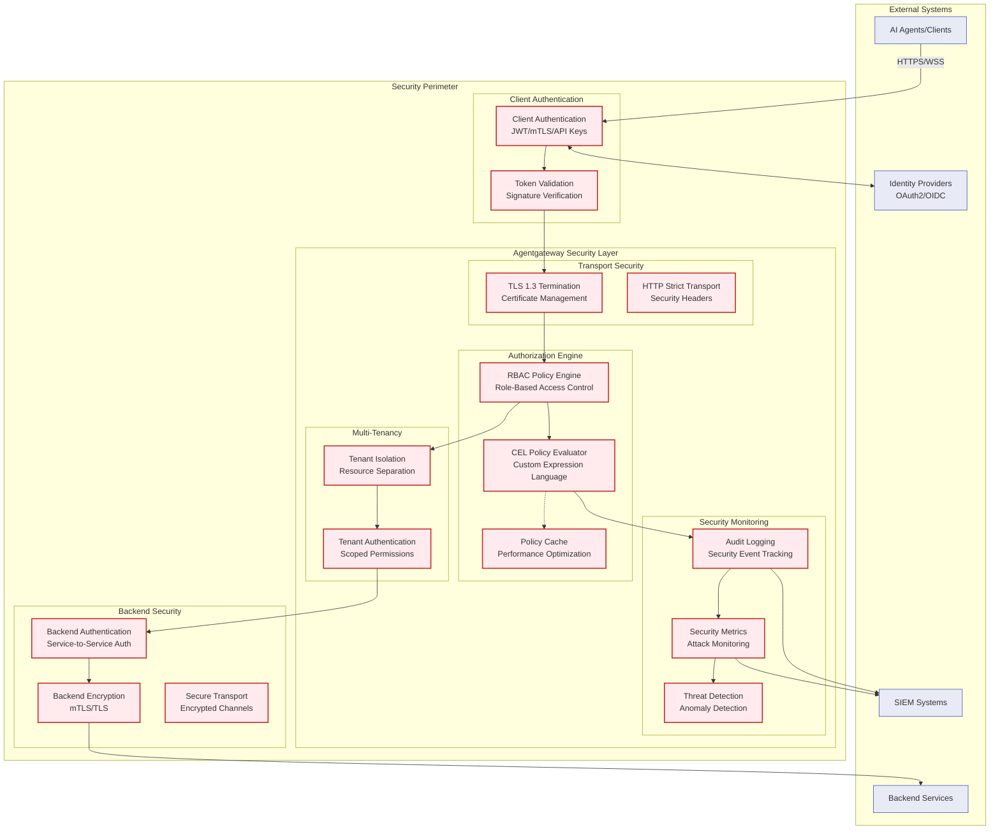
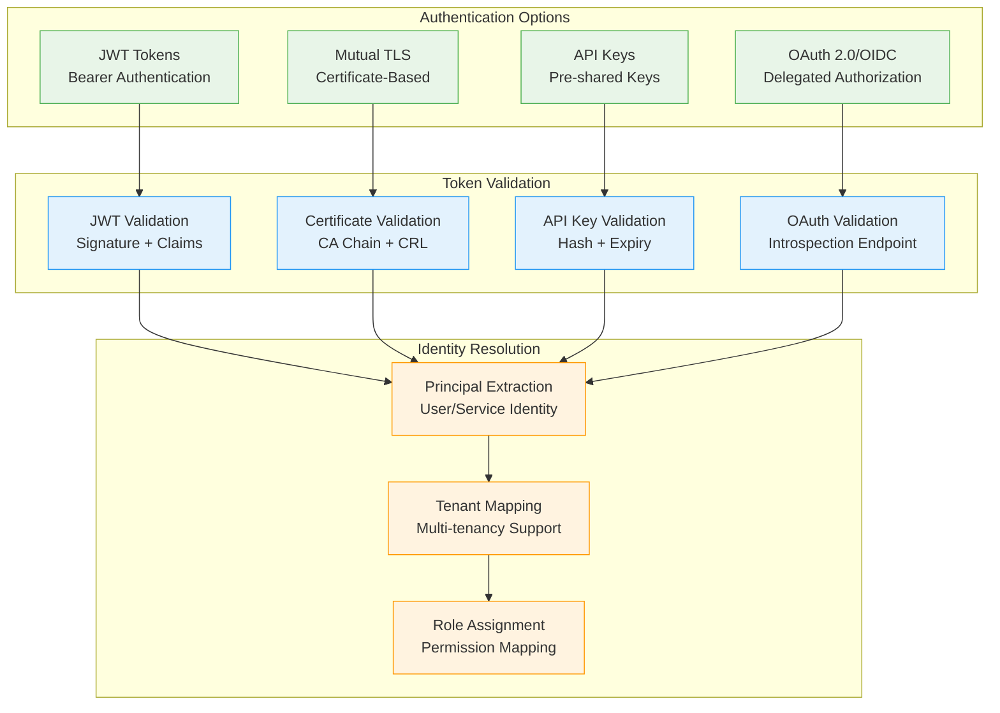
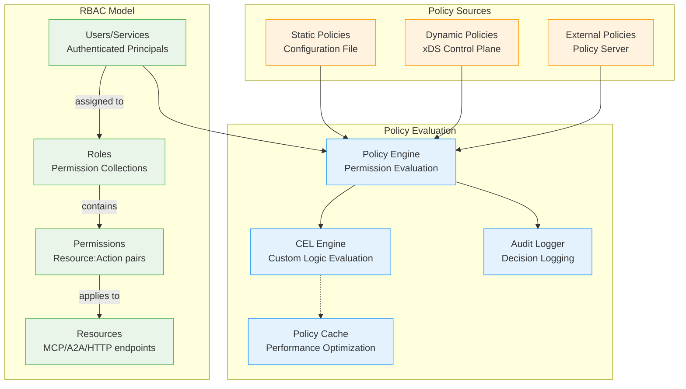
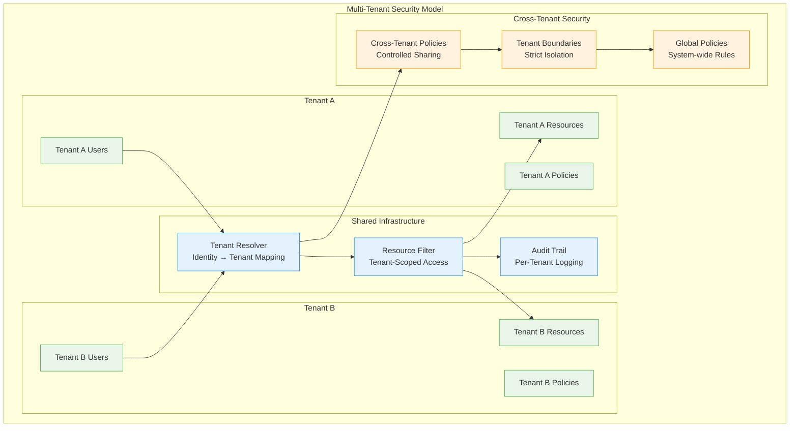
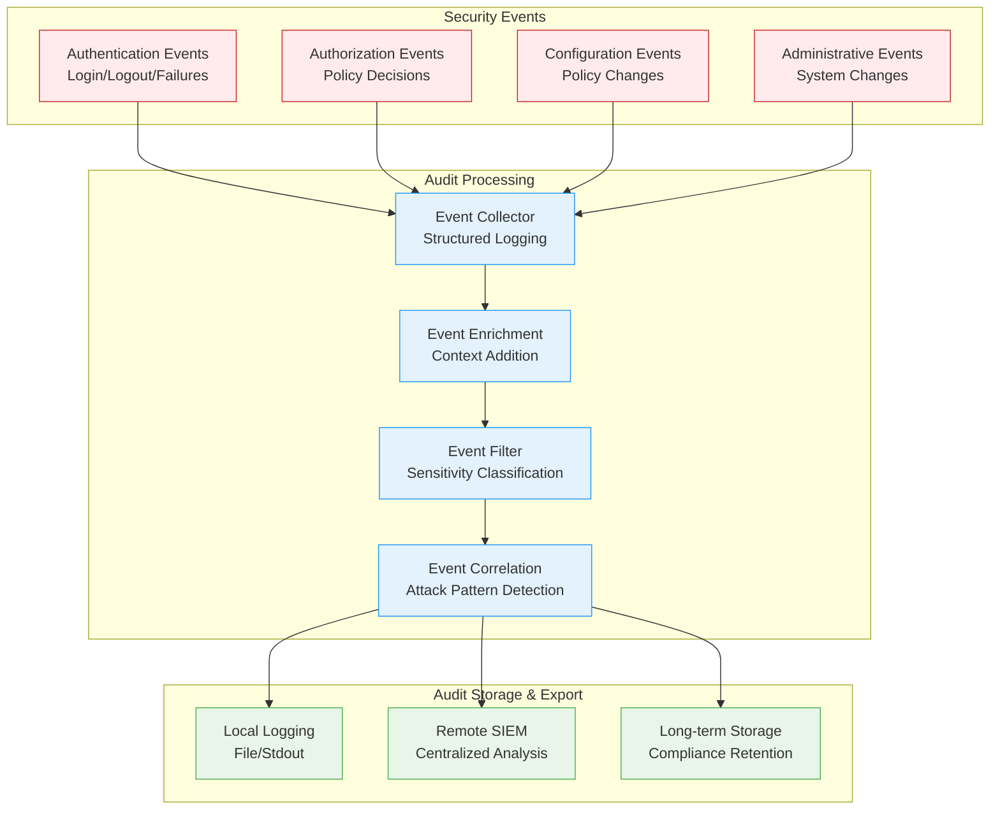

# Security Architecture

## Overview

Agentgateway implements a comprehensive security architecture based on zero-trust principles, providing defense-in-depth security for agentic AI communication. The security model encompasses authentication, authorization, encryption, multi-tenancy, and comprehensive audit logging.

## Security Architecture Diagram



## Security Principles

### Zero Trust Architecture
- **Never Trust, Always Verify**: All requests require authentication and authorization
- **Principle of Least Privilege**: Minimal permissions granted for each operation
- **Assume Breach**: Design for operation in a compromised environment
- **Verify Explicitly**: Continuous validation of identity and permissions

### Defense in Depth
- **Multiple Security Layers**: Transport, authentication, authorization, audit
- **Fail Secure**: Secure defaults and fail-closed behavior
- **Security at Every Layer**: Security controls at network, application, and data layers
- **Redundant Controls**: Multiple overlapping security mechanisms

## Authentication Architecture

### Authentication Methods



### JWT Token Validation

#### JWT Claims Structure
```json
{
  "iss": "https://auth.example.com",
  "sub": "agent-123",
  "aud": "agentgateway",
  "exp": 1672531200,
  "iat": 1672527600,
  "scope": "mcp:read mcp:write",
  "tenant": "tenant-456",
  "roles": ["agent-user", "mcp-client"],
  "capabilities": ["resource:read", "tool:execute"]
}
```

#### Validation Process
1. **Signature Verification**: Verify JWT signature with public key
2. **Claims Validation**: Check issuer, audience, expiration
3. **Scope Validation**: Ensure required scopes are present
4. **Custom Claims**: Extract tenant, roles, and capabilities
5. **Revocation Check**: Optional token revocation list check

### Mutual TLS (mTLS)

#### Certificate-Based Authentication
- **Client Certificates**: X.509 certificates for client identification
- **Certificate Authority**: Trusted CA for certificate validation
- **Certificate Revocation**: CRL and OCSP support for revoked certificates
- **Subject Alternative Names**: Support for multiple identities per certificate

#### mTLS Configuration
```yaml
tls:
  cert_file: "/etc/certs/server.crt"
  key_file: "/etc/certs/server.key"
  ca_file: "/etc/certs/ca.crt"
  client_auth: "require"
  verify_depth: 3
```

## Authorization Architecture

### RBAC (Role-Based Access Control)



### Policy Definition Language

#### RBAC Policy Structure
```yaml
policies:
  - name: "mcp-read-policy"
    description: "Allow reading MCP resources"
    subjects:
      - role: "mcp-reader"
      - user: "agent-123"
    resources:
      - mcp:resources:*
      - mcp:tools:list
    actions:
      - read
      - list
    conditions:
      - tenant == "tenant-456"
      - time.now() < token.exp

  - name: "admin-policy"
    description: "Full administrative access"
    subjects:
      - role: "admin"
    resources:
      - "*"
    actions:
      - "*"
    conditions:
      - source_ip in ["192.168.1.0/24"]
```

### CEL (Common Expression Language) Integration

#### CEL Policy Examples
```javascript
// Time-based access control
time.now() > timestamp("2025-01-01T00:00:00Z") && 
time.now() < timestamp("2025-12-31T23:59:59Z")

// IP-based access control
request.source_ip in ["10.0.0.0/8", "192.168.0.0/16"]

// Tenant-based resource access
resource.tenant == principal.tenant

// Rate limiting policy
request.rate_limit.tokens > 0 && 
request.rate_limit.window < duration("1h")

// Complex business logic
principal.role == "admin" || 
(principal.role == "user" && resource.owner == principal.id)
```

## Multi-Tenancy Security

### Tenant Isolation Architecture



### Tenant Isolation Mechanisms

#### Resource Scoping
- **Tenant ID Injection**: All resources automatically scoped to tenant
- **Database Isolation**: Logical separation of tenant data
- **Configuration Isolation**: Tenant-specific configuration namespaces
- **Metric Isolation**: Per-tenant observability data

#### Cross-Tenant Security Controls
- **Default Deny**: No cross-tenant access by default
- **Explicit Allow**: Cross-tenant access requires explicit permission
- **Audit All Access**: All cross-tenant operations logged
- **Administrator Override**: System administrators can access all tenants

## Transport Security

### TLS Configuration

#### TLS 1.3 Configuration
```yaml
tls:
  min_version: "1.3"
  cipher_suites:
    - "TLS_AES_256_GCM_SHA384"
    - "TLS_CHACHA20_POLY1305_SHA256"
    - "TLS_AES_128_GCM_SHA256"
  certificate_chain: "/etc/certs/chain.pem"
  private_key: "/etc/certs/private.key"
  ocsp_stapling: true
  sni_support: true
```

#### Security Headers
```http
Strict-Transport-Security: max-age=31536000; includeSubDomains
X-Content-Type-Options: nosniff
X-Frame-Options: DENY
X-XSS-Protection: 1; mode=block
Content-Security-Policy: default-src 'self'
Referrer-Policy: strict-origin-when-cross-origin
```

## Security Monitoring and Auditing

### Audit Logging Architecture



### Security Event Schema

#### Audit Log Entry Structure
```json
{
  "timestamp": "2025-01-01T00:00:00Z",
  "event_type": "authorization_decision",
  "severity": "INFO",
  "source": "agentgateway",
  "principal": {
    "type": "service",
    "id": "agent-123",
    "tenant": "tenant-456",
    "roles": ["mcp-client"]
  },
  "request": {
    "method": "POST",
    "path": "/mcp/v1/resources",
    "source_ip": "192.168.1.100",
    "user_agent": "Agent/1.0"
  },
  "policy": {
    "name": "mcp-read-policy",
    "decision": "ALLOW",
    "reason": "Role-based access granted",
    "evaluation_time_ms": 2
  },
  "resource": {
    "type": "mcp:resource",
    "id": "file-system",
    "tenant": "tenant-456"
  },
  "outcome": {
    "status": "SUCCESS",
    "response_code": 200,
    "backend": "file-server"
  },
  "correlation": {
    "request_id": "req-789",
    "trace_id": "trace-123",
    "session_id": "sess-456"
  }
}
```

### Security Metrics

#### Key Security Metrics
- **Authentication Success/Failure Rates**: Monitor authentication attempts
- **Authorization Decision Latency**: Track policy evaluation performance
- **Failed Authorization Attempts**: Detect potential attacks
- **Certificate Expiration**: Monitor certificate lifecycle
- **TLS Handshake Failures**: Identify TLS configuration issues
- **Rate Limiting Triggers**: Track rate limit violations

## Threat Model and Mitigations

### Threat Categories

#### External Threats
1. **Unauthorized Access**: Mitigated by strong authentication
2. **Man-in-the-Middle**: Mitigated by TLS 1.3 and certificate pinning
3. **DDoS Attacks**: Mitigated by rate limiting and circuit breakers
4. **Injection Attacks**: Mitigated by input validation and parameterized queries

#### Internal Threats
1. **Privilege Escalation**: Mitigated by principle of least privilege
2. **Lateral Movement**: Mitigated by network segmentation and zero trust
3. **Data Exfiltration**: Mitigated by audit logging and monitoring
4. **Configuration Tampering**: Mitigated by configuration validation and RBAC

### Security Controls Mapping

| Threat | Risk Level | Primary Control | Secondary Control | Detection Method |
|--------|------------|-----------------|-------------------|------------------|
| Unauthorized Access | High | JWT/mTLS Authentication | IP Allowlisting | Failed auth metrics |
| MITM Attack | High | TLS 1.3 + Certificate Pinning | HSTS Headers | TLS failure logs |
| Policy Bypass | High | RBAC + CEL Evaluation | Audit Logging | Authorization failures |
| Configuration Attack | Medium | Schema Validation | Hot Reload Validation | Config error logs |
| DoS Attack | Medium | Rate Limiting | Circuit Breakers | Request volume metrics |
| Tenant Isolation Breach | High | Resource Scoping | Cross-tenant Auditing | Tenant boundary violations |

## Compliance and Governance

### Compliance Frameworks
- **SOC 2 Type II**: Controls for security, availability, processing integrity
- **ISO 27001**: Information security management system
- **GDPR**: Data protection and privacy requirements
- **HIPAA**: Healthcare data protection (when applicable)
- **PCI DSS**: Payment card data security (when applicable)

### Security Governance
- **Security Policies**: Comprehensive security policy documentation
- **Risk Assessment**: Regular security risk assessments
- **Vulnerability Management**: Regular security testing and patching
- **Incident Response**: Security incident response procedures
- **Security Training**: Ongoing security awareness and training

### Data Protection
- **Data Minimization**: Collect only necessary data
- **Data Encryption**: Encrypt data in transit and at rest
- **Data Retention**: Implement data retention and deletion policies
- **Data Access Controls**: Restrict access to sensitive data
- **Data Audit Trails**: Comprehensive logging of data access