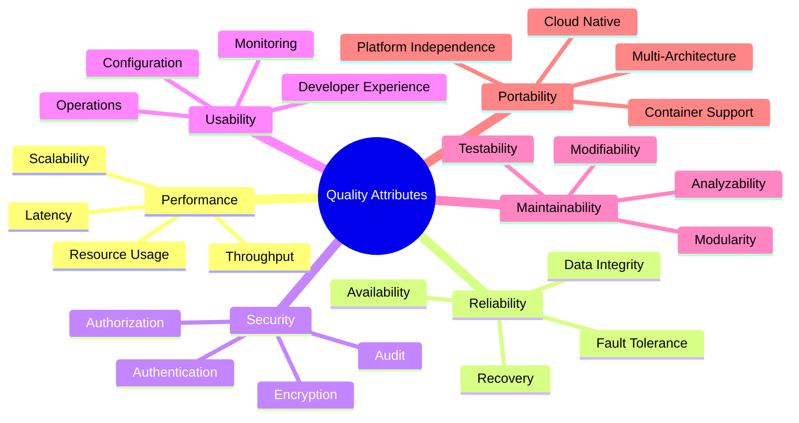
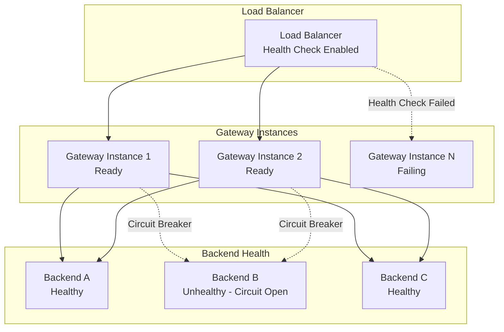
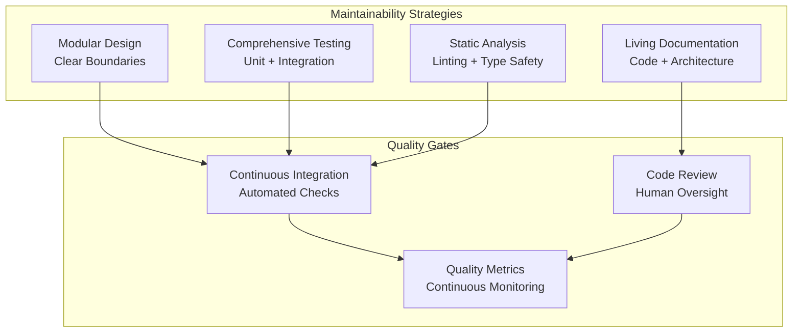
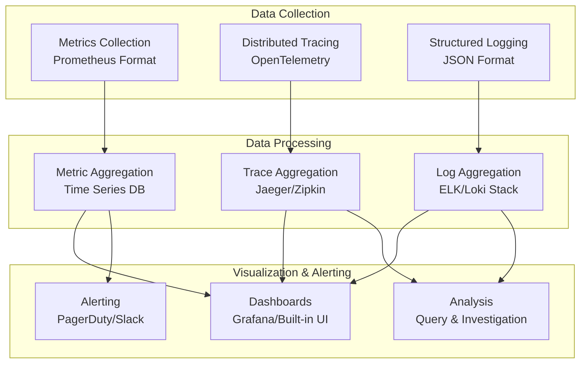

# Quality Attributes and Cross-Cutting Concerns

## Overview

This document defines the quality attributes (non-functional requirements) that drive architectural decisions in Agentgateway, and describes how cross-cutting concerns are addressed throughout the system.

## Quality Attributes Framework

Quality attributes are organized using the ISO 25010 software quality model, adapted for Agentgateway's specific requirements as a high-performance AI agent data plane.



## Performance Quality Attributes

### Response Time and Latency

#### Requirements
- **P99 Latency**: < 10ms for request routing decisions
- **P95 Latency**: < 5ms for request routing decisions  
- **P50 Latency**: < 1ms for request routing decisions
- **Cold Start**: < 100ms for application startup to serving requests
- **Configuration Reload**: < 50ms for hot configuration updates

#### Architecture Strategies
- **Zero-Copy Operations**: Minimize memory copying in request paths
- **Connection Pooling**: Reuse backend connections to avoid handshake overhead
- **Async I/O**: Non-blocking operations throughout the request pipeline
- **Efficient Data Structures**: Use optimized hash maps and caches for routing lookups
- **Memory Locality**: Design data layouts for CPU cache efficiency

#### Measurement and Monitoring
```rust
// Performance metrics collection
pub struct PerformanceMetrics {
    pub request_duration: Histogram,
    pub route_resolution_duration: Histogram, 
    pub policy_evaluation_duration: Histogram,
    pub backend_request_duration: Histogram,
}
```

### Throughput and Scalability

#### Requirements
- **Concurrent Connections**: Support 10,000+ concurrent connections per instance
- **Request Rate**: Handle 100,000+ requests per second per instance
- **Memory Per Connection**: < 1KB average memory usage per connection
- **CPU Utilization**: Maintain < 70% CPU under normal load

#### Scalability Patterns
- **Horizontal Scaling**: Stateless design enabling linear horizontal scaling
- **Load Distribution**: Even distribution of load across worker threads
- **Resource Pooling**: Connection pools, buffer pools, thread pools
- **Backpressure Handling**: Graceful degradation under overload conditions

#### Implementation Strategies
```rust
// Configurable resource limits
pub struct ResourceLimits {
    pub max_concurrent_connections: usize,
    pub connection_pool_size: usize,
    pub worker_thread_count: usize,
    pub memory_limit_mb: usize,
}
```

### Resource Utilization

#### Requirements
- **Memory Usage**: < 100MB baseline, < 1GB under load
- **CPU Usage**: Efficient multi-core utilization with work-stealing
- **Network Bandwidth**: Minimal protocol overhead
- **File Descriptors**: Efficient management of network connections

#### Optimization Strategies
- **Memory Management**: Arena allocation for request processing
- **CPU Optimization**: SIMD instructions where applicable, CPU affinity
- **Network Optimization**: TCP_NODELAY, SO_REUSEPORT, connection pooling
- **Resource Monitoring**: Continuous monitoring with automated alerting

## Reliability Quality Attributes

### Availability

#### Requirements
- **Target Availability**: 99.9% (8.76 hours downtime per year)
- **Planned Downtime**: Zero downtime for configuration updates
- **Recovery Time**: < 30 seconds for restart after failure
- **Health Check Response**: < 1 second for readiness probes

#### High Availability Architecture


#### Implementation
- **Health Checks**: `/ready` and `/health` endpoints with dependency checks
- **Graceful Shutdown**: Drain connections before termination
- **Circuit Breakers**: Prevent cascade failures to unhealthy backends
- **Hot Configuration Reload**: Update configuration without downtime

### Fault Tolerance

#### Failure Modes and Responses
| Failure Mode | Detection Method | Response Strategy | Recovery Time |
|--------------|------------------|-------------------|---------------|
| Backend Service Down | Health checks, request failures | Circuit breaker, retry other backends | Immediate |
| Network Partition | Connection timeouts | Exponential backoff, circuit breaking | 30-60 seconds |
| Memory Exhaustion | Memory monitoring | Graceful degradation, connection limiting | 5-10 seconds |
| Configuration Error | Schema validation | Reject update, keep current config | Immediate |
| Certificate Expiration | Certificate monitoring | Alert, graceful TLS renegotiation | Before expiry |
| Thread Pool Exhaustion | Thread monitoring | Shed load, queue management | 1-5 seconds |

#### Resilience Patterns
```rust
// Circuit breaker implementation
pub struct CircuitBreaker {
    state: Arc<Mutex<CircuitState>>,
    failure_threshold: usize,
    success_threshold: usize,
    timeout: Duration,
}

#[derive(Debug)]
enum CircuitState {
    Closed,
    Open(Instant),
    HalfOpen { success_count: usize },
}
```

### Data Integrity

#### Configuration Integrity
- **Schema Validation**: All configuration validated against JSON Schema
- **Atomic Updates**: Configuration updates are all-or-nothing
- **Rollback Capability**: Ability to revert to previous valid configuration
- **Consistency Checks**: Cross-reference validation (routes → backends)

#### Runtime State Integrity
- **Thread-Safe Operations**: All shared state protected by appropriate synchronization
- **Consistent Reads**: Read operations see consistent snapshots of data
- **Memory Safety**: Rust ownership system prevents data corruption
- **Audit Trails**: All state changes logged for debugging and compliance

## Security Quality Attributes

### Authentication and Authorization

#### Requirements
- **Authentication Time**: < 10ms for JWT validation
- **Authorization Time**: < 5ms for RBAC policy evaluation
- **Token Revocation**: Support for real-time token revocation
- **Multi-Factor Authentication**: Support for MFA where required

#### Security Architecture Integration
- **Zero Trust**: Every request requires authentication and authorization
- **Defense in Depth**: Multiple security layers with different mechanisms
- **Principle of Least Privilege**: Minimal permissions granted by default
- **Security by Default**: Secure configuration defaults

### Encryption and Transport Security

#### Requirements
- **TLS Version**: TLS 1.3 minimum for all external connections
- **Cipher Suites**: Only strong cipher suites (AES-256-GCM, ChaCha20-Poly1305)
- **Certificate Management**: Automatic certificate rotation
- **Perfect Forward Secrecy**: Ephemeral key exchange for all connections

## Usability Quality Attributes

### Developer Experience

#### Requirements
- **Setup Time**: < 10 minutes from clone to running locally
- **Documentation Coverage**: 100% of public APIs documented
- **Error Messages**: Clear, actionable error messages with context
- **Debugging Support**: Rich logging and tracing for troubleshooting

#### Development Tools
- **Hot Reload**: Configuration changes reflected without restart
- **Schema Validation**: Real-time configuration validation
- **Metrics Dashboard**: Built-in UI for monitoring and debugging
- **Example Configurations**: Comprehensive examples for common use cases

### Operational Experience

#### Requirements
- **Monitoring Integration**: Prometheus metrics, OpenTelemetry tracing
- **Log Aggregation**: Structured JSON logs suitable for log aggregation
- **Configuration Management**: Clear configuration hierarchy and precedence
- **Troubleshooting**: Rich diagnostic information and tools

## Maintainability Quality Attributes

### Code Quality and Structure

#### Requirements
- **Test Coverage**: > 80% code coverage for core proxy logic
- **Documentation Coverage**: All public APIs and architectural decisions documented
- **Code Complexity**: Cyclomatic complexity < 10 for individual functions
- **Technical Debt**: Technical debt tracked and managed systematically

#### Architecture for Maintainability


### Testability

#### Testing Strategy
- **Unit Tests**: Fast, isolated tests for individual components
- **Integration Tests**: Test component interactions and external dependencies
- **End-to-End Tests**: Full system tests with real protocols and backends
- **Property-Based Testing**: Generate test cases to find edge cases
- **Performance Tests**: Benchmark critical paths and measure regressions

#### Test Architecture
```rust
// Testable architecture with dependency injection
pub trait BackendClient: Send + Sync {
    async fn send_request(&self, req: Request) -> Result<Response>;
}

pub struct ProxyEngine<C: BackendClient> {
    client: Arc<C>,
    config: Arc<Config>,
}

// Mock implementation for testing
pub struct MockBackendClient {
    responses: Vec<Response>,
}
```

## Portability Quality Attributes

### Platform Independence

#### Requirements
- **Operating Systems**: Linux, macOS, Windows support
- **Architectures**: x86_64, ARM64 support
- **Container Support**: OCI-compliant container images
- **Cloud Platforms**: AWS, GCP, Azure, on-premises deployment

#### Portability Implementation
- **Cross-Compilation**: Cargo cross-compilation for multiple targets
- **Container Images**: Multi-architecture container builds
- **Configuration Portability**: Platform-agnostic configuration format
- **Dependency Management**: Minimize platform-specific dependencies

## Cross-Cutting Concerns

### Observability

#### Comprehensive Observability Stack


#### Implementation
- **Metrics**: Custom Prometheus metrics for business and technical KPIs
- **Tracing**: OpenTelemetry integration with span correlation across services
- **Logging**: Structured JSON logging with correlation IDs and context
- **Health Checks**: Multiple levels of health checking (startup, readiness, liveness)

### Configuration Management

#### Configuration Architecture
```yaml
# Three-layer configuration hierarchy
static_config:    # Environment/CLI - set once at startup
  log_level: info
  worker_threads: 4

local_config:     # YAML/JSON files - hot reload
  binds:
    - port: 3000
      listeners: [...]

xds_config:       # Remote control plane - dynamic updates
  resources:
    - listeners: [...]
    - routes: [...]
```

#### Configuration Quality Attributes
- **Validation**: JSON Schema validation at multiple levels
- **Hot Reload**: Zero-downtime configuration updates
- **Precedence**: Clear precedence rules (xDS > local > static)
- **Versioning**: Configuration versioning and rollback support

### Error Handling and Resilience

#### Error Handling Strategy
```rust
// Comprehensive error handling with context
#[derive(thiserror::Error, Debug)]
pub enum ProxyError {
    #[error("Configuration error: {message}")]
    Configuration { message: String },
    
    #[error("Backend connection failed: {backend} - {source}")]
    BackendConnection { backend: String, #[source] source: anyhow::Error },
    
    #[error("Policy evaluation failed: {policy} - {reason}")]
    PolicyEvaluation { policy: String, reason: String },
}

// Result types with rich error context
pub type ProxyResult<T> = Result<T, anyhow::Error>;
```

#### Resilience Patterns
- **Circuit Breakers**: Prevent cascade failures
- **Retry Logic**: Exponential backoff with jitter
- **Timeouts**: Configurable timeouts at all levels
- **Graceful Degradation**: Continue operating with reduced functionality

## Quality Measurement and Monitoring

### Service Level Indicators (SLIs)

| Quality Attribute | SLI | Target | Measurement Method |
|------------------|-----|--------|-------------------|
| Availability | Percentage of successful requests | 99.9% | HTTP status codes |
| Latency | P99 request duration | < 10ms | Request timing |
| Throughput | Requests per second | 100k RPS | Request counter |
| Error Rate | Percentage of failed requests | < 0.1% | Error counter |
| Security | Authentication success rate | 99.99% | Auth metrics |
| Configuration | Hot reload success rate | 100% | Config reload metrics |

### Service Level Objectives (SLOs)

- **Availability SLO**: 99.9% availability over rolling 30-day period
- **Latency SLO**: 95% of requests complete within 5ms
- **Error Rate SLO**: Error rate below 0.1% over rolling 24-hour period
- **Security SLO**: No security incidents resulting in data breach

### Quality Gates in CI/CD

```yaml
# Quality gates enforced in CI/CD pipeline
quality_gates:
  unit_tests:
    coverage_threshold: 80%
    pass_rate: 100%
  
  integration_tests:
    pass_rate: 100%
    performance_regression: 5%
  
  security_scans:
    vulnerability_threshold: "medium"
    dependency_audit: "pass"
  
  code_quality:
    complexity_threshold: 10
    maintainability_index: "B"
```

This comprehensive quality attributes framework ensures that Agentgateway meets its performance, reliability, security, and maintainability goals while providing measurable targets and monitoring capabilities.