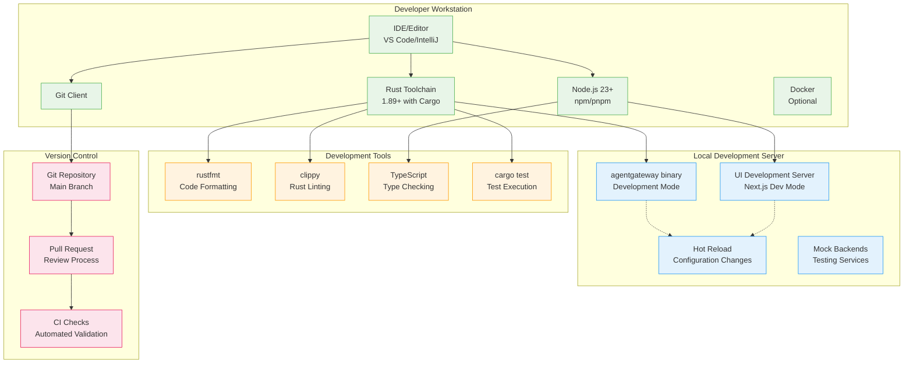
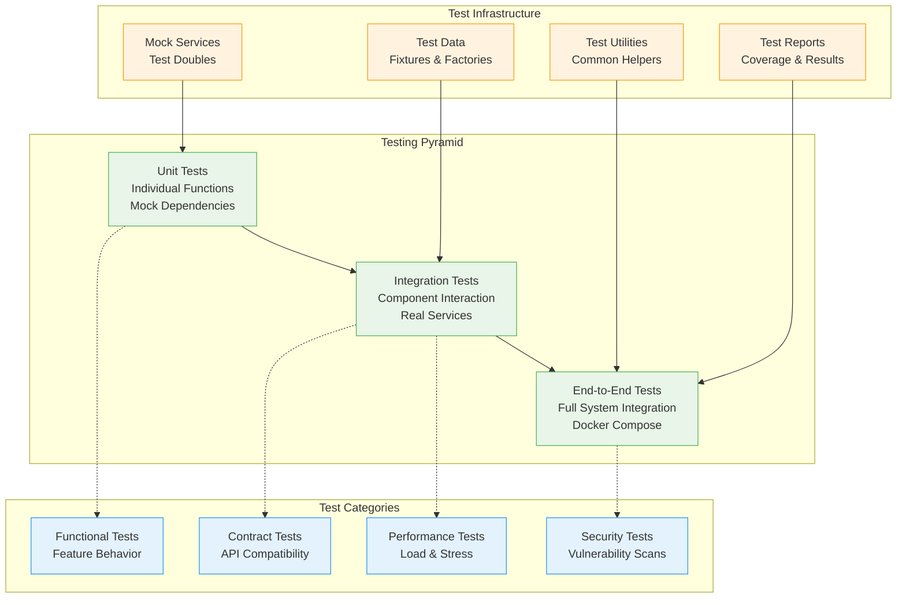
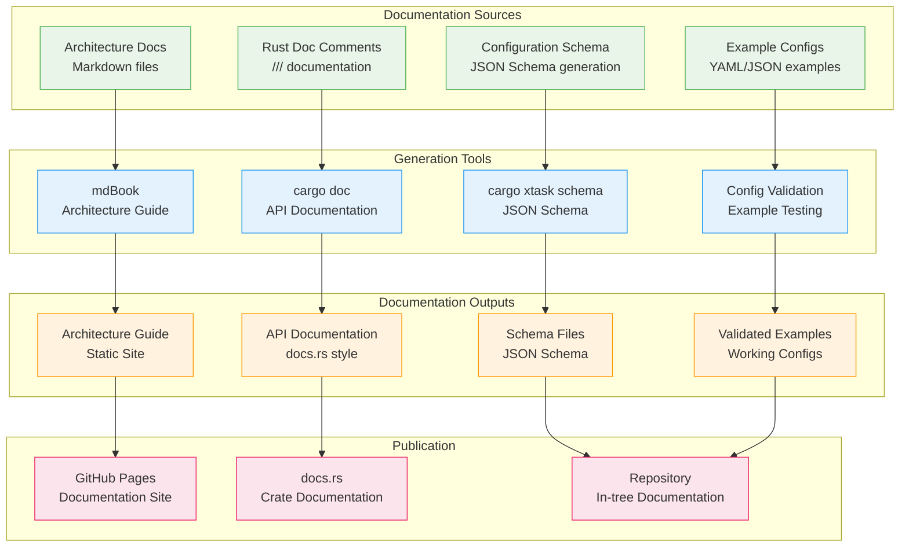

# Development Architecture

## Overview

This document describes the development environment, build processes, testing strategies, and automation frameworks that support the Agentgateway project. It covers the development lifecycle from local development to production deployment.

## Development Environment Architecture



## Build System Architecture

### Multi-Stage Build Process

```mermaid
graph LR
    subgraph "Frontend Build"
        UISource[UI Source Code<br/>TypeScript/React]
        UIBuild[UI Build Process<br/>npm run build]
        UIAssets[Static Assets<br/>HTML/CSS/JS]
    end
    
    subgraph "Backend Build"
        RustSource[Rust Source Code<br/>Cargo Workspace]
        AssetEmbed[Asset Embedding<br/>include_dir! macro]
        RustBuild[Rust Build Process<br/>cargo build]
        Binary[Final Binary<br/>agentgateway]
    end
    
    subgraph "Build Optimization"
        LTO[Link Time Optimization<br/>lto = true]
        Strip[Symbol Stripping<br/>strip = true]
        Compression[Binary Compression<br/>upx (optional)]
    end
    
    UISource --> UIBuild
    UIBuild --> UIAssets
    UIAssets --> AssetEmbed
    
    RustSource --> AssetEmbed
    AssetEmbed --> RustBuild
    RustBuild --> LTO
    LTO --> Strip
    Strip --> Compression
    Compression --> Binary
    
    classDef frontend fill:#e3f2fd,stroke:#2196f3
    classDef backend fill:#e8f5e8,stroke:#4caf50
    classDef optimization fill:#fff3e0,stroke:#ff9800
    
    class UISource,UIBuild,UIAssets frontend
    class RustSource,AssetEmbed,RustBuild,Binary backend
    class LTO,Strip,Compression optimization
```

### Build Configuration

#### Cargo Configuration (`Cargo.toml`)
```toml
[workspace]
resolver = "2"
members = [
    "crates/agentgateway-app",
    "crates/agentgateway", 
    "crates/core",
    # ... other crates
]

[profile.release]
codegen-units = 1
lto = true
panic = "abort"
strip = "symbols"

[profile.quick-release]
inherits = "release"
codegen-units = 16
lto = false
incremental = true
```

#### UI Build Configuration (`ui/package.json`)
```json
{
  "scripts": {
    "dev": "next dev --turbopack",
    "build": "npm run lint -- --fix && next build",
    "start": "next start",
    "lint": "next lint"
  },
  "dependencies": {
    "next": "15.5.2",
    "react": "^19.1.1",
    "@types/node": "^20",
    "typescript": "^5"
  }
}
```

### Cross-Platform Building

#### Target Platform Matrix
```yaml
build_targets:
  linux:
    x86_64: "x86_64-unknown-linux-musl"
    arm64: "aarch64-unknown-linux-musl"
    features: ["jemalloc"]
  
  macos:
    arm64: "aarch64-apple-darwin"
    features: ["default"]
  
  windows:
    x86_64: "x86_64-pc-windows-msvc"
    features: ["default"]
```

## Testing Architecture

### Testing Strategy Pyramid



### Test Implementation Patterns

#### Unit Testing Framework
```rust
#[cfg(test)]
mod tests {
    use super::*;
    use tokio_test;
    
    #[tokio::test]
    async fn test_route_resolution() {
        let config = create_test_config();
        let resolver = RouteResolver::new(config);
        
        let request = create_test_request("/api/v1/test");
        let route = resolver.resolve_route(&request).await.unwrap();
        
        assert_eq!(route.name, "test-route");
        assert_eq!(route.backend, "test-backend");
    }
    
    #[test]
    fn test_configuration_validation() {
        let invalid_config = r#"{ "invalid": "json" }"#;
        let result = parse_config(invalid_config.to_string(), None);
        
        assert!(result.is_err());
        assert!(result.unwrap_err().to_string().contains("validation"));
    }
}
```

#### Integration Testing Framework
```rust
// Integration test with real services
#[tokio::test]
async fn test_mcp_proxy_integration() {
    let mock_server = MockMcpServer::start().await;
    let config = create_integration_config(mock_server.port());
    
    let proxy = start_proxy_with_config(config).await;
    let client = McpClient::connect(proxy.port()).await.unwrap();
    
    let response = client.list_resources().await.unwrap();
    assert!(!response.resources.is_empty());
    
    proxy.shutdown().await;
    mock_server.shutdown().await;
}
```

#### Property-Based Testing
```rust
use proptest::prelude::*;

proptest! {
    #[test]
    fn test_configuration_parsing_properties(
        config in arbitrary_valid_config(),
    ) {
        let serialized = serde_yaml::to_string(&config).unwrap();
        let parsed = parse_config(serialized, None).unwrap();
        
        prop_assert_eq!(config, parsed);
    }
}

fn arbitrary_valid_config() -> impl Strategy<Value = Config> {
    // Generate random but valid configurations
    (any::<u16>(), any::<String>()).prop_map(|(port, name)| {
        Config {
            binds: vec![Bind { port, listeners: vec![] }],
            // ... other fields
        }
    })
}
```

## Continuous Integration Architecture

### CI/CD Pipeline Structure

```mermaid
graph LR
    subgraph "Code Changes"
        PR[Pull Request<br/>Feature Branch]
        Merge[Merge to Main<br/>Protected Branch]
    end
    
    subgraph "CI Pipeline"
        Checkout[Checkout Code<br/>Actions/checkout@v4]
        Setup[Setup Environment<br/>Rust + Node.js]
        Cache[Dependency Cache<br/>Cargo + npm]
        
        subgraph "Build Stage"
            UIBuild[Build UI<br/>npm run build]
            RustBuild[Build Rust<br/>cargo build]
        end
        
        subgraph "Test Stage"  
            UnitTest[Unit Tests<br/>cargo test]
            Integration[Integration Tests<br/>docker-compose]
            Lint[Linting<br/>clippy + eslint]
        end
        
        subgraph "Quality Gates"
            Security[Security Scan<br/>cargo audit]
            Coverage[Code Coverage<br/>tarpaulin]
            Performance[Performance Test<br/>criterion]
        end
        
        subgraph "Artifact Stage"
            Package[Package Binary<br/>Multi-platform]
            Container[Container Build<br/>Docker/OCI]
            Release[Release Publish<br/>GitHub Releases]
        end
    end
    
    PR --> Checkout
    Checkout --> Setup
    Setup --> Cache
    Cache --> UIBuild
    Cache --> RustBuild
    
    UIBuild --> UnitTest
    RustBuild --> UnitTest
    UnitTest --> Integration
    Integration --> Lint
    
    Lint --> Security
    Security --> Coverage
    Coverage --> Performance
    
    Performance --> Package
    Package --> Container
    Container --> Release
    
    Merge --> Release
    
    classDef code fill:#e8f5e8,stroke:#4caf50
    classDef ci fill:#e3f2fd,stroke:#2196f3
    classDef build fill:#fff3e0,stroke:#ff9800
    classDef test fill:#fce4ec,stroke:#e91e63
    classDef quality fill:#f3e5f5,stroke:#9c27b0
    classDef artifact fill:#e0f2f1,stroke:#00796b
    
    class PR,Merge code
    class Checkout,Setup,Cache ci
    class UIBuild,RustBuild build
    class UnitTest,Integration,Lint test
    class Security,Coverage,Performance quality
    class Package,Container,Release artifact
```



### GitHub Actions Configuration

#### Main Workflow (`.github/workflows/pull_request.yml`)
```yaml
name: CI

on:
  push:
    branches: [main]
  pull_request:
    branches: [main]

jobs:
  build:
    strategy:
      matrix:
        include:
          - os: ubuntu-latest
            target: x86_64-unknown-linux-musl
            features: jemalloc
          - os: macos-latest  
            target: aarch64-apple-darwin
            features: default
          - os: windows-latest
            target: x86_64-pc-windows-msvc
            features: default

    runs-on: ${{ matrix.os }}
    
    steps:
    - uses: actions/checkout@v4
    
    - name: Setup Node.js
      uses: actions/setup-node@v4
      with:
        node-version: 23
        
    - name: Setup Rust
      uses: dtolnay/rust-toolchain@stable
      with:
        targets: ${{ matrix.target }}
        
    - name: Cache Dependencies
      uses: actions/cache@v4
      with:
        path: |
          ~/.cargo/registry
          ~/.cargo/git
          target/
          ui/node_modules/
        key: ${{ runner.os }}-${{ hashFiles('**/Cargo.lock', '**/package-lock.json') }}
    
    - name: Build UI
      run: |
        cd ui
        npm ci
        npm run build
        
    - name: Build Rust
      run: cargo build --target ${{ matrix.target }} --features ${{ matrix.features }}
      
    - name: Run Tests
      run: |
        cargo test --all-targets
        cargo clippy -- -D warnings
```

### Quality Gates and Automation

#### Code Quality Checks
```yaml
quality_checks:
  formatting:
    rust: "cargo fmt --check"
    typescript: "npm run lint"
  
  linting:
    rust: "cargo clippy -- -D warnings"
    typescript: "eslint --ext .ts,.tsx"
  
  testing:
    unit: "cargo test --all-targets" 
    integration: "make validate"
    coverage: "cargo tarpaulin --coveralls"
  
  security:
    audit: "cargo audit"
    vulnerability_scan: "trivy fs ."
    
  performance:
    benchmarks: "cargo bench"
    regression_check: "compare with baseline"
```

## Documentation Automation

### Documentation Generation Pipeline



### Documentation Maintenance Automation

#### Automated Documentation Tasks
```yaml
# xtask automation for documentation
documentation_tasks:
  schema_generation:
    command: "cargo xtask schema"
    output: "schema/local.json"
    trigger: "type definitions change"
    
  example_validation:
    command: "make validate"
    coverage: "all examples/*.yaml"
    trigger: "configuration schema change"
    
  api_documentation:
    command: "cargo doc --no-deps"
    output: "target/doc/"
    trigger: "public API changes"
    
  architecture_build:
    command: "mdbook build"
    output: "book/"
    trigger: "architecture/*.md changes"
```

#### Documentation Quality Checks
```rust
// Automated documentation quality checks
#[test]
fn test_documentation_coverage() {
    let missing_docs = find_undocumented_public_apis();
    assert!(missing_docs.is_empty(), 
           "Found undocumented public APIs: {:#?}", missing_docs);
}

#[test]
fn test_example_configurations() {
    for example_file in glob("examples/*/*.yaml").unwrap() {
        let config_content = fs::read_to_string(example_file).unwrap();
        let config = parse_config(config_content, None);
        assert!(config.is_ok(), "Example configuration should be valid");
    }
}

#[test]
fn test_schema_consistency() {
    let generated_schema = generate_json_schema();
    let existing_schema = fs::read_to_string("schema/local.json").unwrap();
    assert_eq!(generated_schema, existing_schema, 
              "Schema files are out of sync - run 'cargo xtask schema'");
}
```

## Development Workflow Automation

### Developer Experience Tools

#### Pre-commit Hooks
```yaml
# .pre-commit-config.yaml
repos:
  - repo: local
    hooks:
      - id: rust-fmt
        name: Rust formatting
        entry: cargo fmt
        language: rust
        files: \.rs$
        
      - id: rust-clippy
        name: Rust linting
        entry: cargo clippy -- -D warnings
        language: rust
        files: \.rs$
        
      - id: typescript-lint
        name: TypeScript linting
        entry: npm run lint
        language: node
        files: \.(ts|tsx)$
        
      - id: config-validation
        name: Configuration validation
        entry: make validate
        language: system
        files: examples/.*\.ya?ml$
```

#### Development Scripts (`scripts/`)
```bash
#!/bin/bash
# scripts/dev-setup.sh - Developer environment setup

set -euo pipefail

echo "Setting up Agentgateway development environment..."

# Check prerequisites
check_prerequisites() {
    command -v cargo >/dev/null || { echo "Rust not found. Install from https://rustup.rs/"; exit 1; }
    command -v node >/dev/null || { echo "Node.js not found. Install version 23+"; exit 1; }
    command -v git >/dev/null || { echo "Git not found"; exit 1; }
}

# Install development dependencies
install_dependencies() {
    echo "Installing Rust components..."
    rustup component add clippy rustfmt rust-docs
    
    echo "Installing UI dependencies..."
    cd ui && npm install && cd ..
    
    echo "Installing pre-commit hooks..."
    pip install pre-commit
    pre-commit install
}

# Build and test
build_and_test() {
    echo "Building UI assets..."
    cd ui && npm run build && cd ..
    
    echo "Building Rust binary..."
    cargo build
    
    echo "Running tests..."
    cargo test
    
    echo "Validating configurations..."
    make validate
}

main() {
    check_prerequisites
    install_dependencies
    build_and_test
    
    echo "✅ Development environment setup complete!"
    echo "Run 'cargo run' to start the development server"
}

main "$@"
```

### Release Automation

#### Automated Release Workflow
```yaml
# .github/workflows/release.yml
name: Release

on:
  push:
    tags: ['v*']

jobs:
  release:
    runs-on: ubuntu-latest
    steps:
      - uses: actions/checkout@v4
      
      - name: Build Release Artifacts
        run: |
          make build
          make docker
          
      - name: Create GitHub Release
        uses: softprops/action-gh-release@v1
        with:
          files: |
            target/release/agentgateway-*
            *.tar.gz
          generate_release_notes: true
          
      - name: Publish Container Images
        run: |
          docker push ghcr.io/agentgateway/agentgateway:${{ github.ref_name }}
          docker push ghcr.io/agentgateway/agentgateway:latest
```

This comprehensive development architecture ensures efficient development workflows, high code quality, automated testing, and reliable releases while maintaining excellent developer experience.